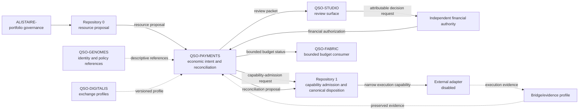

# A.L.I.S.T.A.I.R.E. Integration Boundary

## Portfolio role

A.L.I.S.T.A.I.R.E. is the canonical system objective. QSO-PAYMENTS is its bounded **economic-intent, allocation-preview, evidence, dispute, and reconciliation subsystem**. It may describe resource needs, proposed allocations, approval requests, expected accounting effects, adapter requirements, receipts, reversals, disputes, and reconciliation states.

It does not own autonomous-development orchestration, generic capability issuance, financial approval, credentials, signing, custody, adapter operation, or settlement.

> **Current release surface:** documentation only. Every interface on this page is a contract proposal, not an executable payment path.

## Contribution to autonomous development

QSO-PAYMENTS can support faster engineering by making economic reasoning explicit and reviewable:

- record a bounded resource request linked to an objective, task, and repository;
- distinguish estimated cost, requested cap, approved limit, committed amount, actual receipt, and reconciled amount;
- compare fictional or externally supplied options without purchasing;
- prepare an authorization request for a named human or separately approved financial service;
- preserve evidence of approval, denial, expiry, revocation, hold, failure, reversal, dispute, or reconciliation;
- reconcile returned evidence against the accepted intent and capability;
- expose missing, stale, contradictory, or unverifiable evidence instead of inventing success.

System urgency, model confidence, a QSO genome, repository ownership, generic capability, prior approval, UI state, or adapter success cannot become financial permission by implication.

## Portfolio assignments

| Concern | Candidate responsibility | Authority limit |
|---|---|---|
| Product governance | `ALISTAIRE-` | Defines accepted portfolio boundaries; does not approve individual payments |
| Resource proposal and engineering context | Repository `0` | May prepare a local proposal and evidence; cannot approve or fund it |
| Economic intent and reconciliation | QSO-PAYMENTS | Validates and records economic semantics; holds no credentials or custody |
| Human review | QSO-STUDIO or another approved interface | Presents evidence and captures attributable decisions; presentation is not authority |
| Financial authorization | Named human or separately approved financial authority | Approves exact amount, destination class, environment, conditions, and expiry |
| Generic capability and canonical disposition | Repository `1`, if approved | May admit, narrow, revoke, and record an execution capability after financial approval; cannot invent approval |
| Declarative identity/policy | QSO-GENOMES | Provides versioned references; cannot grant financial authority |
| Collaboration budgets | QSO-FABRIC | May produce or consume bounded budget proposals; cannot approve or settle them |
| Exchange profiles | QSO-DIGITALIS | Provides inert versioned projections where approved; no execution authority |
| Transport/evidence profile | Bridge or extracted approved profile | Carries or validates evidence; transport success is not financial finality |
| External adapter | Separately governed service, disabled | Uses isolated credentials only under an accepted unexpired capability |

Repository names do not establish authority. Every consequential role requires an approved contract, identity, and revocation path.

## Portfolio context



The independent financial authority and Repository `1` are separate concerns. Repository `1` may verify and admit an approved financial authorization into a narrower technical capability, but it must not create or broaden financial approval.

## End-to-end resource lifecycle

```mermaid
sequenceDiagram
    participant R0 as Repository 0
    participant P as QSO-PAYMENTS
    participant S as Review surface
    participant F as Financial authority
    participant R1 as Repository 1
    participant X as Disabled adapter
    participant E as Evidence profile

    R0->>P: Resource proposal + objective + provenance
    P->>P: Validate identity, environment, cap, expiry, replay, and policy
    P-->>R0: Rejection evidence if invalid or prohibited
    P->>S: Reviewable intent and allocation preview
    S->>F: Attributable approval request
    F-->>P: Approve, deny, expire, or revoke exact financial scope
    P->>R1: Capability-admission request + authorization evidence
    R1->>R1: Verify authenticity, scope, policy, expected state, and revocation
    R1-->>X: Narrow capability; current scope stops before execution
    X-->>E: Separately supplied simulation or future adapter evidence
    E-->>P: Pending, receipt, failure, unknown, reversal, or dispute evidence
    P->>P: Reconcile without inferred finality
    P-->>R1: Canonical-disposition proposal
    P-->>R0: Bounded evidence summary without credentials
```

At the current documentation stage, the sequence ends at a disabled adapter boundary. No repository artifact or workflow can progress the sequence into a transfer.

## Interface contracts

### Repository `0` → QSO-PAYMENTS

A future resource proposal should include:

- immutable proposal ID and schema version;
- A.L.I.S.T.A.I.R.E. objective, task, and repository references;
- purpose and necessity statement;
- requested unit, amount, cap, environment, and expiry;
- fictional option comparison or attributed quote references;
- requester, device/environment, and provenance references;
- conflicts, alternatives, and consequences of denial;
- idempotency key, replay domain, and policy-profile reference.

The input must not contain credentials, private keys, complete payment-account identifiers, or an assertion that authorization already exists.

### QSO-PAYMENTS → review surface

A review packet must make independently visible:

1. requested outcome and supporting evidence;
2. proposed amount, unit, fees, taxes, and maximum exposure;
3. allocation, precision, rounding, and remainder rules;
4. environment and adapter status;
5. quote source, valuation time, and freshness;
6. privacy classification and retention policy;
7. expiry, revocation, retry, correction, and dispute rules;
8. uncertainty, missing evidence, and conflicts;
9. the exact financial authority being requested.

### Financial authority → QSO-PAYMENTS

Authorization must be a separate attributable record. It identifies the approver or approved service role, exact intent, amount limit, destination or destination class, environment, conditions, timestamps, expiry, revocation path, jurisdictional assumptions, and policy version.

Approval for one intent cannot authorize another intent, another environment, a larger amount, a different destination, or a reusable spending capability.

### QSO-PAYMENTS → Repository `1`

A capability-admission request binds the accepted authorization to an exact execution purpose, adapter, environment, expected pre-state, amount, destination class, duration, nonce, evidence obligations, and rollback path.

Repository `1` may reject or narrow the request. It cannot broaden it or create financial approval when the authorization is absent, invalid, stale, expired, revoked, unsupported, or mismatched.

### Adapter/evidence profile → QSO-PAYMENTS

Returned evidence may use states such as `SUBMITTED`, `PENDING`, `FAILED`, `UNKNOWN`, `DISPUTED`, `REVERSED`, or `RECONCILED`. It must identify the intent, authorization, capability, adapter, attempt, timestamps, amounts, fees, redacted destination reference, provisional/final status, raw-evidence hash, and correction route.

The development system receives bounded summaries and evidence references, never reusable credentials. An adapter receipt is not unconditional proof of legal or financial finality.

## Capability and authority matrix

| Capability | QSO-PAYMENTS | Repository `0` | Financial authority | Repository `1` | External adapter |
|---|---:|---:|---:|---:|---:|
| Propose a resource need | Record/validate | Yes | May review | No | No |
| Estimate fictional costs | Document contract | May request | May review | No | No |
| Approve financial scope | No | No | Yes, if designated | No by implication | No |
| Admit narrow technical capability | Request only | No | Supplies approval evidence | Candidate, if approved | No |
| Hold credentials or signing material | No | No | Only under separate policy | No by inheritance | Adapter-specific, separately governed |
| Allocate an approved total | Future offline simulation | No | Approves rules and limits | May verify capability scope | No |
| Submit a transfer | No | No | No direct submission by implication | Capability only, if approved | Disabled until separate approval |
| Record receipts and disputes | Future evidence contract | May consume summaries | May adjudicate | May record disposition | May return evidence |
| Infer success from missing evidence | Never | Never | Never | Never | Never |

## Autonomous evolution constraints

A.L.I.S.T.A.I.R.E. may propose improvements to documentation, schemas, fixtures, tests, threat models, and review packets. It may not:

- grant itself financial capabilities;
- approve its own intent or policy exception;
- create, retrieve, rotate, or use payment credentials;
- change from documentation to simulation, testnet, or production by implication;
- weaken expiry, revocation, idempotency, replay, privacy, finality, evidence, or audit requirements;
- inherit merge, release, deployment, custody, signing, or financial authority from a QSO identity, genome, repository, model, or successful workflow;
- represent legal, regulatory, security, accessibility, or financial approval without retained attributable evidence.

Autonomous development accelerates preparation and verification; it does not erase separation of duties.

## Failure containment

Minimum controls for any future executable candidate include:

- fail-closed environment and adapter gates;
- per-intent amount, destination, frequency, time, and objective limits;
- independent financial authorization, capability admission, revocation, and emergency stop;
- shared idempotency and replay domains;
- append-only evidence, correction, supersession, and dispute records;
- explicit pending, unknown, partial-failure, reversal, and recovery states;
- credential isolation outside QSO records, repositories, logs, model context, and public artifacts;
- emergency disable independent of Repository `0`, QSO-PAYMENTS, and the adapter;
- incident preservation, cache invalidation, and cross-repository bounded restart.

## Required gluing evidence

The route is not accepted until shared deterministic fixtures prove:

- proposal-to-intent mapping without authority promotion;
- financial authorization distinct from generic capability;
- scope is equal or narrower across intent, authorization, capability, and adapter instruction;
- stale, replayed, wrong-identity, over-limit, wrong-destination, wrong-environment, expired, and revoked records fail closed;
- fixed-precision allocation, fees, taxes, rounding, and remainders reconcile;
- pending, partial failure, retries, reversal, refund, dispute, and correction preserve evidence;
- adapter evidence transformations preserve raw hashes, redaction declarations, uncertainty, and finality limits;
- emergency stop revokes active capabilities, preserves evidence, invalidates caches, and requires explicit recovery approval.

See the [obstruction and gluing analysis](OBSTRUCTION_AND_GLUING.md) for the full ledger and witness groups.

## Ownership decisions still required

The portfolio must designate:

1. the independent financial authority and revoker;
2. Repository `1`'s accepted or rejected role in capability admission and canonical disposition;
3. the owner of intent, authorization, capability, receipt, dispute, reconciliation, correction, and revocation schemas;
4. canonical identity and subject namespaces;
5. jurisdictions, currencies, rails, privacy classes, retention periods, and licensing assumptions;
6. adapter credentials, signing, custody, monitoring, incident, emergency-stop, and recovery owners;
7. human approvals required for simulation, testnet, and production transitions;
8. how Bridge, QSO-DIGITALIS, QSO-STUDIO, QSO-FABRIC, Repository `0`, and Repository `1 exchange records without inheriting authority.

Until those decisions are approved and recorded, QSO-PAYMENTS remains documentation-only with every external boundary disabled.
