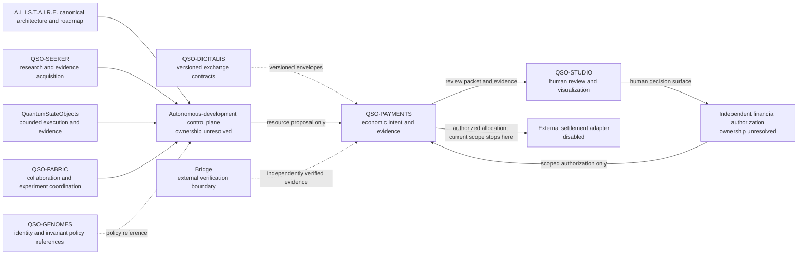

# A.L.I.S.T.A.I.R.E. Integration Boundary

## Portfolio role

A.L.I.S.T.A.I.R.E. is the canonical system objective. QSO-PAYMENTS is its bounded **economic-intent and evidence subsystem**: it may describe resource needs, proposed allocations, approval requests, expected accounting effects, adapter requirements, receipts, disputes, and reconciliation states. It does not own autonomous-development orchestration and it does not confer authority to hold credentials, sign transactions, custody assets, or move funds.

The distinction is deliberate. A system may autonomously discover that work requires a resource, estimate a budget, compare options, prepare an approval packet, and verify returned evidence without autonomously acquiring financial authority.

> **Current release surface:** documentation only. Every interface on this page is an architectural contract proposal, not an executable payment path.

## Contribution to autonomous development

QSO-PAYMENTS can support faster autonomous engineering by making economic reasoning explicit and reviewable:

- record a bounded resource request linked to an objective and task;
- distinguish estimated cost from approved limit and actual receipt;
- compare fictional or externally supplied options without purchasing;
- prepare an authorization request for a designated human or approved service;
- preserve immutable evidence of approval, denial, expiry, revocation, failure, or dispute;
- reconcile returned receipts against the approved intent;
- expose unresolved or contradictory evidence instead of inventing success.

It cannot turn system urgency, model confidence, prior approval, repository ownership, or a QSO genome into financial permission.

## Portfolio context



The autonomous-development control plane and the independent financial authorization authority are separate concerns. They may exchange signed, versioned records in a future approved design, but they must not silently collapse into one service or identity.

## End-to-end resource lifecycle

```mermaid
sequenceDiagram
    participant C as Development control plane
    participant P as QSO-PAYMENTS
    participant S as QSO-STUDIO
    participant A as Independent authorizer
    participant X as Disabled adapter boundary
    participant E as Evidence/reconciliation

    C->>P: Resource proposal + objective + provenance
    P->>P: Validate environment, limits, expiry, and policy reference
    P-->>C: Rejection evidence if invalid or prohibited
    P->>S: Reviewable intent and allocation preview
    S->>A: Explicit approval request
    A-->>P: Approve, deny, expire, or revoke within scope
    P->>P: Deterministic allocation and reconciliation preview
    P-->>X: Held instruction; no adapter authority in current scope
    X-->>E: Fictional or separately supplied result evidence
    E-->>P: Receipt, failure, unknown, or dispute record
    P-->>C: Evidence summary without inferred finality
```

At the current documentation stage, the sequence ends at a documented, disabled adapter boundary. No repository artifact or workflow can progress the sequence into a transfer.

## Interface contracts

### Input from the development control plane

A future resource proposal should include:

- immutable proposal identifier and schema version;
- A.L.I.S.T.A.I.R.E. objective, task, and repository references;
- purpose and necessity statement;
- requested unit, amount, cap, and expiry;
- fictional option comparison or externally sourced quote references;
- requester identity, provenance, and environment;
- declared conflicts, alternatives, and consequences of denial;
- idempotency key and policy-profile reference.

The input must not contain credentials, private keys, complete payment-account identifiers, or an assertion that authorization already exists.

### Output to human review

A review packet should make the following independently visible:

1. requested outcome and evidence;
2. proposed amount and maximum authorized exposure;
3. allocation and rounding rules;
4. environment and adapter status;
5. privacy classification and retention policy;
6. expiry, revocation, retry, and dispute rules;
7. uncertainty, missing evidence, and unresolved conflicts;
8. the exact authority being requested.

### Returned authorization

Authorization must be a separate, attributable record. It should identify the approver or approved service role, exact scope, amount limit, destinations or allowed classes, environment, conditions, timestamps, expiry, revocation state, and policy version. Approval for one intent cannot authorize another intent, another environment, or a wider capability.

### Evidence returned to A.L.I.S.T.A.I.R.E.

The development system may receive status and evidence such as `DENIED`, `EXPIRED`, `REVOKED`, `HELD`, `SIMULATED`, `FAILED`, `UNKNOWN`, `DISPUTED`, or `RECONCILED`. It must not receive reusable credentials or treat an adapter receipt as unconditional proof of legal or financial finality.

## Capability and authority matrix

| Capability | QSO-PAYMENTS | Development control plane | Human/approved authorizer | External adapter |
|---|---:|---:|---:|---:|
| Propose a resource need | Record and validate | Yes | May review | No |
| Estimate or compare fictional costs | Document future contract | May request | May review | No |
| Approve financial scope | No | No | Yes, if designated | No |
| Hold credentials or signing material | No | No by inheritance | Only under separate policy | Adapter-specific, separately governed |
| Allocate an approved total | Future deterministic simulation | No | Approves rules/limits | No |
| Submit a transfer | No | No | No direct submission by implication | Disabled until separate approval |
| Record receipts and disputes | Future evidence contract | May consume summaries | May adjudicate | May return evidence |
| Infer success from missing evidence | Never | Never | Never | Never |

## Autonomous evolution constraints

A.L.I.S.T.A.I.R.E. may autonomously propose improvements to QSO-PAYMENTS documentation, schemas, fixtures, tests, threat models, and review packets. Consequential changes remain gated:

- no self-granting of financial capabilities;
- no self-approval of an intent or policy exception;
- no creation, retrieval, rotation, or use of production credentials;
- no change from documentation to simulation, testnet, or production by implication;
- no weakening of expiry, revocation, idempotency, privacy, or audit requirements;
- no merging or deployment authority inherited from a QSO identity or genome;
- no representation of legal, regulatory, security, or accessibility approval without retained evidence.

Autonomous development accelerates preparation and verification; it does not erase the separation of duties.

## Failure containment

A payment-related failure must remain contained from the wider cognitive system. Minimum controls for any future executable candidate include:

- fail-closed environment and adapter gates;
- per-intent amount, destination, frequency, and time limits;
- independent authorization and revocation;
- idempotency and duplicate suppression;
- append-only evidence and correction records;
- explicit `UNKNOWN` and partial-failure states;
- credential isolation outside QSO records and public artifacts;
- emergency disable independent of the development control plane;
- incident preservation and cross-repository rollback references.

## Ownership decisions still required

The portfolio must designate, without silently assigning authority to this repository:

1. the canonical autonomous-development control plane;
2. the authority allowed to issue and revoke financial capability grants;
3. the owner of identity, policy, and authorization schema versions;
4. jurisdictional, privacy, retention, licensing, and review assumptions;
5. the owner of adapter credentials, signing, custody, monitoring, and incident response;
6. the human approvals required for simulation, testnet, and production transitions;
7. portfolio-wide emergency-stop and rollback coordination;
8. how Bridge, QSO-DIGITALIS, and QSO-STUDIO exchange evidence without inheriting authority.

Until those decisions are approved and recorded, QSO-PAYMENTS remains a documentation-only subsystem with a disabled external boundary.
