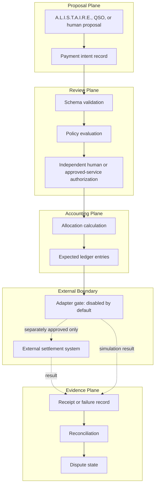
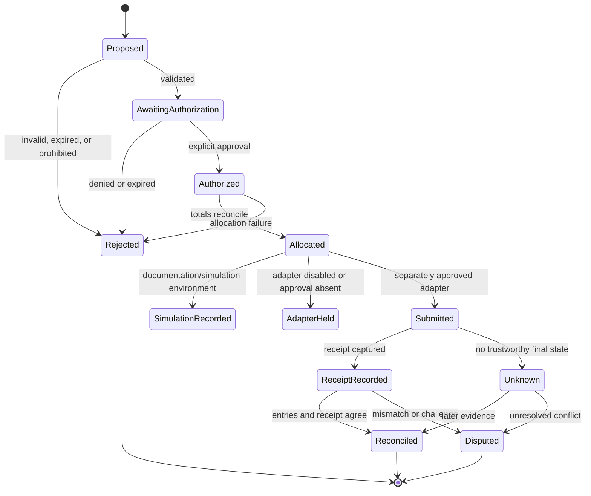
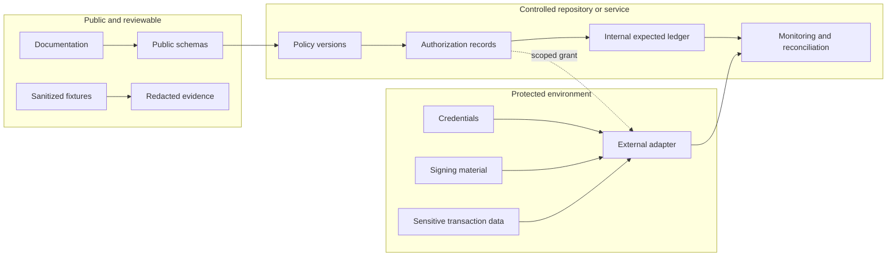

# QSO-PAYMENTS Architecture

## Design objective

The architecture preserves a strict separation between economic proposals and external financial authority. Each stage emits a new, attributable record instead of mutating the prior stage into a stronger claim.

## A.L.I.S.T.A.I.R.E. subsystem boundary

A.L.I.S.T.A.I.R.E. is the canonical system objective. QSO-PAYMENTS is a subordinate economic-intent and evidence subsystem, not the portfolio control plane. The control plane may request that this subsystem represent and validate a resource proposal, but it cannot inherit payment authorization, credentials, custody, signing, settlement, merge, deployment, or policy-exception authority from this repository.

The full portfolio interaction, capability matrix, and unresolved ownership decisions are documented in [A.L.I.S.T.A.I.R.E. Integration Boundary](ALISTAIRE_INTEGRATION.md).

## Invariants

1. A QSO or autonomous-development service cannot approve its own payment intent.
2. A valid schema is not authorization.
3. Authorization is scoped, revocable, attributable, and environment-specific.
4. Allocations reconcile exactly under declared rounding and remainder rules.
5. Adapters are disabled unless a separate approval activates a named environment and version.
6. Credentials and private keys never appear in intent or public evidence records.
7. Receipts are evidence supplied by an adapter, not proof that every external system reached final settlement.
8. Original intent, authorization, allocation, receipt, and dispute records are append-only.
9. Replays and retries use idempotency keys and cannot duplicate an economic action.
10. `UNKNOWN` or unresolved status is preferable to inventing settlement certainty.
11. Repository, QSO, genome, task, or system identity never implies financial capability.
12. A documentation, simulation, testnet, or production transition requires an explicit, separately recorded decision.

## Record lifecycle

The lifecycle vocabulary is a design contract, not evidence that an adapter or settlement implementation exists.

## Capability separation

| Capability | Documentation state | Runtime state | Required authority |
|---|---|---|---|
| Propose an economic intent | Defined | Not implemented | Bounded caller identity |
| Validate shape and policy | Defined | Not implemented | Versioned schema and policy owner |
| Authorize a transfer | Boundary defined | Not implemented | Independent named authority |
| Calculate allocations | Defined | Not implemented | Reviewed deterministic algorithm |
| Sign or submit | Prohibited by default | Not implemented | Environment-specific capability grant |
| Record receipts | Defined | Not implemented | Approved adapter and evidence policy |
| Reconcile or dispute | Defined | Not implemented | Accounting and human-review authority |
| Override policy | Not granted | Not implemented | Explicit exceptional authority outside A.L.I.S.T.A.I.R.E. |

## Trust boundaries

Protected data never becomes a public fixture merely because a workflow succeeds. Public evidence must be redacted, minimized, and independently reviewed.

## Repository dependency position

QSO-PAYMENTS depends on accepted upstream identity, capability, canonicalization, evidence, and review contracts. It must not define competing canonical identities or infer authority from a repository name.

Provisional boundaries:

- **Bridge** may transport approved proposal and evidence envelopes but does not grant payment authority.
- **QSO-DIGITALIS** may define coordination records but does not hold credentials or settle transactions.
- **QSO-STUDIO** may present review evidence but does not autonomously approve economic actions.
- **QSO-SEEKER** may retrieve approved public information but does not fetch private financial records without a separate deployment authorization.
- **QuantumStateObjects** may model bounded object state but does not inherit signing, custody, or transfer capability.
- **QSO-FABRIC** may coordinate bounded experiments but does not self-fund or approve production transfers.

Every integration remains blocked until exact contract versions, fixture hashes, authority ownership, migration rules, and rollback behavior are accepted.

## Failure behavior

The subsystem must fail closed when:

- identity, environment, currency, amount, policy, or authorization is absent;
- totals do not reconcile;
- a capability is expired, revoked, or outside scope;
- idempotency state is missing;
- receipt evidence is malformed or contradictory;
- credentials or signing material appear in public records;
- an autonomous caller attempts self-authorization;
- production is selected without an approved transition record; or
- system state is unknown.

A failure emits a bounded reason code and evidence reference. It does not silently retry, broaden authority, or reinterpret a proposal as approval.

## Deployment boundary

The documentation can be built in CI with read-only repository access. Any future application, worker, adapter, queue, database, custody provider, signing service, or settlement integration requires a separate architecture decision, threat model, credential ceremony, environment approval, observability plan, incident owner, tested rollback, and post-deployment verification.
