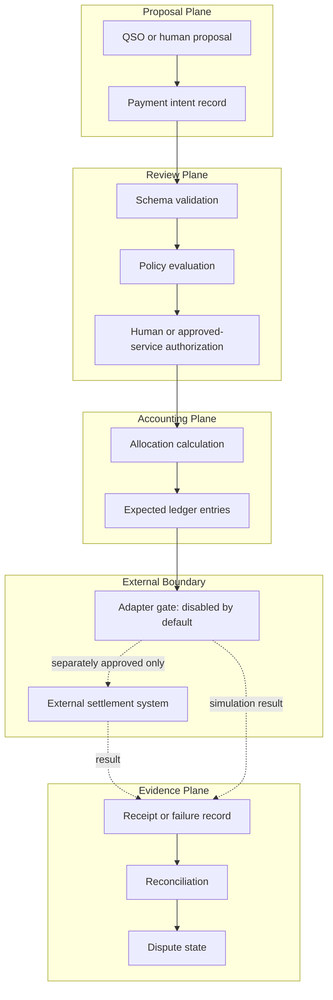
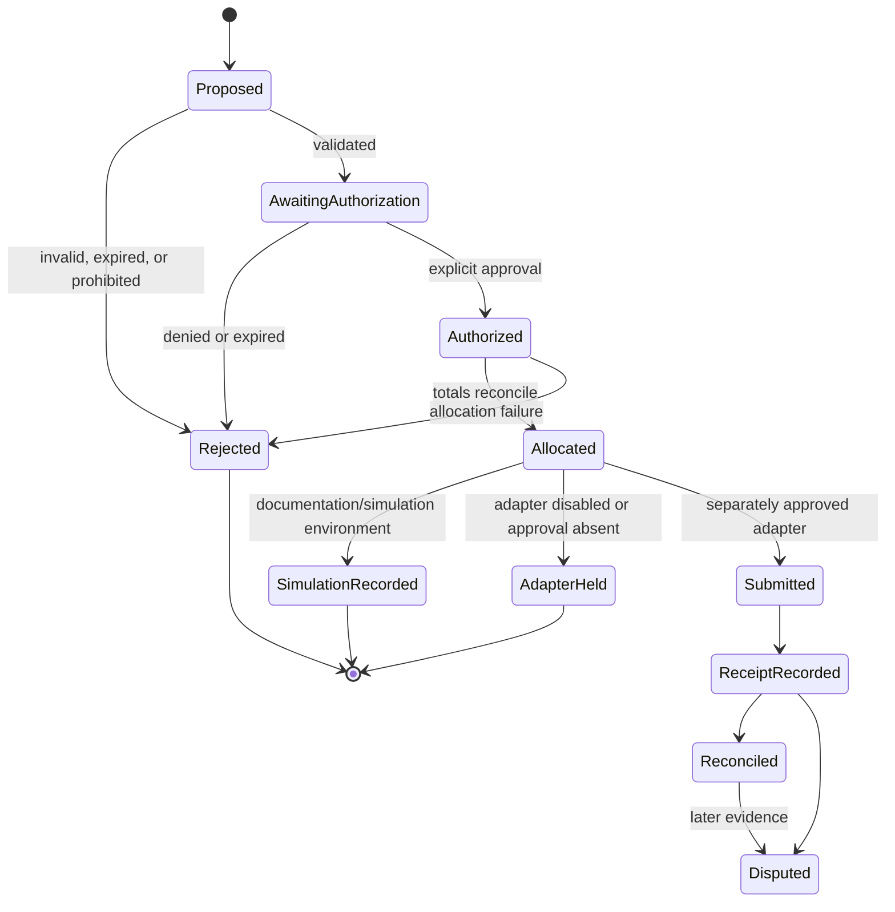

# QSO-PAYMENTS Architecture

## Design objective

The architecture preserves a strict separation between economic proposals and external financial authority. Each stage emits a new, attributable record instead of mutating the prior stage into a stronger claim.

## Invariants

1. A QSO cannot approve its own payment intent.
2. A valid schema is not authorization.
3. Authorization is scoped, revocable, attributable, and environment-specific.
4. Allocations reconcile exactly under declared rounding and remainder rules.
5. Adapters are disabled unless a separate approval activates a named environment and version.
6. Credentials and private keys never appear in intent or public evidence records.
7. Receipts are evidence supplied by an adapter, not proof that every external system reached final settlement.
8. Original intent, authorization, allocation, receipt, and dispute records are append-only.
9. Replays and retries use idempotency keys and cannot duplicate an economic action.
10. `UNKNOWN` or unresolved status is preferable to inventing settlement certainty.

## Record lifecycle

## Data classification

| Data class | Examples | Publication rule |
|---|---|---|
| Public documentation | Contract descriptions, fictional fixtures, diagrams | May be published after claims and accessibility review |
| Internal operational | Workflow logs, adapter configuration, incident evidence | Restricted and retained according to policy |
| Sensitive financial metadata | Account identifiers, counterparties, amounts tied to people | Minimize, redact, encrypt, and never publish by default |
| Secrets | Credentials, private keys, signing material | Never store in repository records or generated documentation |

## Adapter boundary

An adapter interface may eventually accept an authorized, allocated instruction and return a structured result. Until separately approved, adapters remain conceptual or mocked. Any future adapter must document:

- supported environment and network;
- authentication and secret storage;
- request signing and replay protection;
- idempotency and retry behavior;
- timeout, partial failure, and reconciliation semantics;
- rate limits and dependency risks;
- receipt verification and finality limitations;
- disable, revocation, incident, and rollback procedures.

## Repository dependencies

QSO-PAYMENTS may consume read-only, versioned references from QSO-GENOMES, QuantumStateObjects, QSO-FABRIC, and QSO-STUDIO. It must not import their execution authority. QSO-STUDIO may display payment evidence, but it cannot authorize or settle. QSO-FABRIC may generate bounded proposals, but it cannot custody or sign. Upstream identity or genome metadata does not confer financial permission.

## Verification strategy

For the documentation candidate:

- validate links, HTML, metadata, and responsive layout;
- review every claim against the current documentation-only boundary;
- test keyboard navigation, focus visibility, semantics, scaling, and contrast;
- inspect workflow permissions and action pinning;
- verify no secrets or sensitive identifiers are present;
- build from a clean checkout and hash the artifact;
- record rollback to the prior verified Pages artifact.

For a later simulation candidate, add deterministic schema validation, allocation/reconciliation fixtures, duplicate/replay tests, rounding edge cases, timeout and failure tests, and explicit proof that no external transfer path is reachable.
