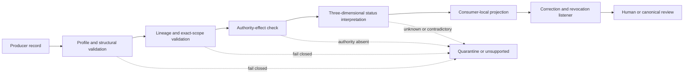

# Consumer integration and conformance guide

Status: **documentation-only integration profile**

This guide explains how a future consumer would read QSO-PAYMENTS records without acquiring payment authority, silently promoting uncertain outcomes, or collapsing distinct lifecycle states. It is not an executable SDK, API commitment, schema release, adapter contract, or authorization mechanism.

## Integration rule

A consumer may interpret only the record family, profile version, exact predecessor links, status dimensions, evidence class, and authority effect that the accepted contract explicitly grants. Transport, receipt, parsing success, rendering, workflow completion, or local convenience must not broaden meaning.

```text
received != authenticated
parsed != valid
valid != authorized
authorized != admitted
admitted != executed
adapter-reported != reconciled
reconciled != canonically accepted
canonically accepted != legal finality
```

## Intended consumers

This guide applies to bounded future consumers such as:

- Repository `0` proposal and evidence workflows;
- Repository `1` capability-admission and canonical-disposition review;
- QSO-STUDIO or another approved human review surface;
- QSO-FABRIC projection and aggregate-evidence tooling;
- disabled adapter controllers;
- documentation, audit, accessibility, and incident-review tools.

No consumer is registered or approved merely because it appears in this document.

## Integration architecture



**Equivalent prose:** A consumer first validates the declared profile and record structure. It then verifies lineage, exact scope, and predecessor relations. Next it checks the record’s explicit authority effect and interprets processing, authority, and evidence/finality statuses independently. Only then may it build a local projection. The projection remains subscribed to correction and revocation updates and cannot become canonical without the separately approved human or Repository `1` disposition route. Unsupported, ambiguous, contradictory, or authority-inflating records remain quarantined or unsupported.

## Required consumer declaration

A future consumer registration should declare, at minimum:

| Field | Meaning |
|---|---|
| `consumer_id` | Immutable consumer identity under an approved namespace |
| `consumer_version` | Exact immutable implementation or documentation generation |
| `accepted_profiles` | Closed list of profile identifiers and versions |
| `accepted_record_types` | Closed list of record families |
| `accepted_environments` | Documentation, simulation, testnet, or production scopes explicitly approved |
| `authority_effects_understood` | Closed list, normally including `none` and explicitly excluding inference |
| `status_dimensions` | Processing, authority, and evidence/finality dimensions supported independently |
| `reason_code_registry` | Exact accepted registry generation |
| `correction_endpoint` | Bounded route for correction, revocation, withdrawal, and supersession updates |
| `acknowledgment_policy` | Time limit and evidence required to acknowledge propagated changes |
| `privacy_profile` | Data minimization, redaction, retention, disclosure, and deletion rules |
| `rollback_generation` | Last independently verified consumer state and restoration procedure |

Unknown or omitted declarations block compatibility claims.

## Safe integration sequence

### 1. Establish source identity

Record:

- repository and producer identity;
- exact source generation;
- profile and schema version;
- observation time and method;
- environment;
- declared classification;
- retained source or artifact digest when available.

A branch name, filename, package name, queue, database table, or HTTP route is not sufficient source identity.

### 2. Validate the envelope

Reject or quarantine when:

- the profile or record type is unsupported;
- required fields are missing or malformed;
- time lacks a timezone;
- the environment is absent or broader than approved;
- canonical or source digests do not match the accepted profile;
- unknown fields are forbidden by the profile;
- an optional binding is required by policy but omitted.

Validation success establishes structural conformance only.

### 3. Validate lineage and scope

Verify the exact proposal, intent, authorization, capability, allocation, submission, evidence, reconciliation, dispute, correction, and revocation links relevant to the record. A consumer must not substitute a record with the same display label, amount, destination, or correlation identifier.

Material differences in requester, beneficiary, payee, destination, asset, amount, precision, purpose, environment, adapter, device, enrollment generation, workspace, repository, expected head, policy, time window, or authority source require a new review or an explicit incompatibility disposition.

### 4. Interpret authority explicitly

Consumers must read an explicit authority effect. In the current documentation candidate, examples and proposed records have no operational authority unless a separately approved independent financial-authorization record says otherwise.

A consumer must never infer authority from:

- a complete form;
- trusted-device state;
- Repository `0`, Repository `1`, QSO, model, or workflow identity;
- successful validation;
- technical capability admission;
- adapter availability;
- a signature whose signer authority is not independently established;
- repeated prior approval;
- urgency or budget pressure.

### 5. Preserve three status dimensions

Store and render separately:

1. **Processing status** — technical workflow progress.
2. **Authority status** — independent financial decision state.
3. **Evidence/finality status** — adapter evidence, reconciliation, canonical disposition, and external finality evidence.

Do not compress the dimensions into a single success flag. A record can be technically complete, financially unauthorized, and evidentially unknown at the same time.

### 6. Handle retries and unknown outcomes

An unknown outcome is not permission to create a new idempotency domain. Before retrying, a consumer must preserve:

- the original intent and authorization bindings;
- the original idempotency and replay domains;
- prior request and adapter evidence;
- the retry budget and decision owner;
- duplicate-effect detection;
- a route to hold rather than retry when evidence remains insufficient.

A timeout or inaccessible adapter does not prove failure and does not erase possible side effects.

### 7. Subscribe to corrections and revocations

Consumers must support append-only updates for:

- corrections;
- revocations;
- withdrawals;
- superseding records;
- reversals and refunds;
- disputes and resolution records;
- emergency-stop and recovery records.

On receipt, the consumer invalidates dependent cached views, marks the prior generation as historical or unusable as directed, records acknowledgment evidence, and propagates the change to its own registered dependents. Unreachable or non-acknowledging consumers remain blocking findings.

### 8. Preserve uncertainty and disputes

Missing, stale, conflicting, partial, redacted, or inaccessible evidence must remain visible. A consumer must distinguish:

- fact observed directly;
- adapter-reported claim;
- interpretation;
- recommendation;
- independent authorization;
- canonical disposition;
- disputed or corrected evidence;
- unknown finality.

### 9. Produce a bounded projection

A consumer-local view should include:

- source record and profile identity;
- exact scope and environment;
- all three status dimensions;
- actor, owner, or explicit vacancy;
- active disputes, corrections, revocations, and supersession;
- uncertainty and missing evidence;
- permitted next action;
- explicit statement that the view is not canonical unless separately accepted.

## Consumer response matrix

| Condition | Required response | Forbidden response |
|---|---|---|
| Unsupported profile | Quarantine as unsupported | Best-effort interpretation as accepted |
| Unknown record type | Reject or preserve inertly | Map to a similar record family |
| Missing authority | `DOCUMENTED_NOT_AUTHORIZED`, `BLOCKED`, or equivalent | Infer approval from validation or history |
| Wrong device/workspace/head | Fail closed and request fresh review | Ignore the binding as operational detail |
| Expired or revoked authorization | Prevent future use and propagate invalidation | Reuse because execution was previously allowed |
| Adapter reports success | Record `ADAPTER_REPORTED` evidence | Claim reconciliation, settlement, or finality |
| Partial result | Preserve route-level outcomes and unresolved remainder | Promote global success |
| Unknown result | Hold, reconcile, and preserve idempotency | Retry with a fresh key automatically |
| Correction received | Link new generation and invalidate derivatives | Edit or delete prior evidence |
| Consumer unreachable | Record blocking propagation failure | Assume eventual consistency completed |
| Conflicting evidence | Mark disputed or indeterminate | Select the more convenient result silently |

## Conformance fixtures

A future shared fixture corpus should include positive and hostile cases for:

- exact supported profile and record type;
- unsupported profile or unknown field;
- wrong requester, beneficiary, destination, adapter, device, workspace, repository, or expected head;
- amount, precision, fee, tax, remainder, and allocation mismatch;
- expired, revoked, superseded, withdrawn, corrected, or disputed records;
- stale authorization or stale device enrollment;
- duplicate, replay, timeout, partial, unknown, reversal, and refund outcomes;
- missing predecessor or substituted digest;
- adapter-reported success without reconciliation;
- canonical disposition without legal-finality evidence;
- correction propagation to all consumers;
- unreachable consumer and failed rollback;
- direct migration versus multi-hop migration equivalence.

Every participating repository must evaluate identical fixture bytes and publish its exact result, reason code, version, and retained evidence before compatibility is claimed.

## Accessibility requirements

Consumer interfaces must expose as visible text:

- record type and environment;
- processing, authority, and evidence/finality states;
- exact scope;
- actor, owner, or vacancy;
- observation time and freshness;
- active correction, revocation, dispute, or supersession;
- uncertainty and missing evidence;
- permitted next action and prohibited inference.

Status must not depend on color, animation, iconography, diagram position, hover content, or hidden developer tools. Tables should linearize meaningfully, and diagrams require equivalent prose.

## Privacy and confidentiality

Consumer integration must minimize data. Public fixtures and artifacts must exclude credentials, private keys, complete account or destination identifiers, private device identifiers, private communications, production transaction details, and unnecessary personal data.

A consumer must declare why each field is needed, who may access it, how long it is retained, how corrections and deletion requests are handled, and how evidence is preserved without exposing secret material.

## Rollback and restoration

Before accepting a consumer generation, retain:

- previous verified consumer generation;
- exact accepted profiles and registries;
- migration map and known lossy fields;
- cached-state invalidation procedure;
- correction and revocation replay procedure;
- test fixtures and expected results;
- restoration command or manual procedure;
- independently observed restored-state evidence.

Rollback fails closed when restored state cannot prove that revoked, corrected, disputed, or superseded records remain invalidated.

## Reviewer checklist

- [ ] Consumer identity and exact generation are explicit.
- [ ] Accepted profiles, records, environments, statuses, and reason codes are closed and versioned.
- [ ] Structural validation is not represented as authority.
- [ ] Processing, authority, and evidence/finality statuses remain independent.
- [ ] Scope intersections cannot broaden authorization.
- [ ] Unknown, partial, stale, disputed, or contradictory evidence remains non-successful.
- [ ] Idempotency and replay handling cover timeout and unknown outcomes.
- [ ] Corrections, revocations, withdrawals, and supersession invalidate derivatives and reach every registered consumer.
- [ ] Consumer acknowledgment and unreachable-consumer behavior are defined.
- [ ] Privacy, retention, accessibility, incident, rollback, and restoration evidence are reviewable.
- [ ] The consumer cannot appoint an authorizer, issue credentials, activate an adapter, or create canonical or legal finality.

## FYSA-120 capability mapping

Applied capabilities:

- `011-B` and `011-E` — accessible architecture diagrams, prose equivalence, and cross-modal integrity;
- `012-A`, `012-B`, `012-C`, `012-D`, and `012-E` — information architecture, API-style exposition, integration procedures, documentation testing, and lifecycle synchronization;
- `015-B` and `015-E` — terminology and contract translation with semantic-equivalence assurance;
- `017-C`, `017-D`, and `017-E` — provenance, version-substitution detection, audit packaging, and correction propagation;
- `018-B`, `018-D`, and `018-E` — responsibility mapping, onboarding transfer, and privacy-aware record governance;
- `019-B`, `019-C`, and `019-D` — plain language, accessible status presentation, and uncertainty communication;
- `031-A`, `031-D`, and `031-E` — interface invariants, hostile conformance fixtures, regression prevention, and assurance maintenance;
- `032-D` and `032-E` — distributed failure handling, replay, recovery, observability, and incident diagnosis;
- `040-D` and `040-E` — compatibility migration, rollback, record integrity, and restored-state verification.

Proposed non-authoritative subdivision:

**`012-S — authority-preserving consumer integration guides for multi-dimensional status, correction-closed records, and fail-closed compatibility`**

The proposed subdivision would cover consumer declarations, safe integration sequences, status-preserving projections, retry/unknown-outcome guidance, correction and revocation subscriptions, accessible response matrices, and restoration-aware conformance documentation.

Taxonomy mapping does not establish implementation competence, consumer registration, contract ownership, financial authorization, publication approval, or operational authority.
