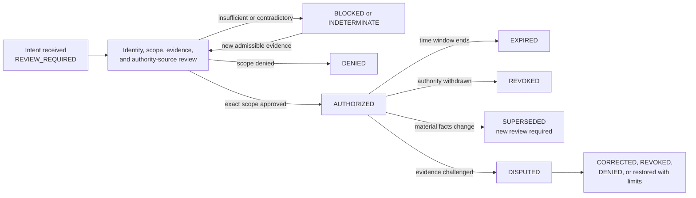

# Independent financial authorization review

Status: **DOCUMENTED_NOT_AUTHORIZED**

This guide defines the documentation and evidence required to review one bounded financial authorization without turning a proposal, validation result, interface interaction, trusted device, repository capability, or adapter response into permission to move assets. It is a review protocol only. It does not appoint an authorizer, create a credential, approve a payment, activate an adapter, or establish legal or canonical finality.

## Review objective

A reviewer should be able to determine, from one exact evidence package:

1. which economic intent is under review;
2. who is requesting, benefiting from, validating, authorizing, implementing, reconciling, and revoking;
3. what amount, destination, environment, adapter, device, workspace, repository, expected head, and time window are in scope;
4. which conditions must remain true;
5. which facts are observed, inferred, disputed, stale, private, or missing;
6. how approval, denial, expiry, revocation, correction, withdrawal, dispute, and recovery propagate;
7. what authority is explicitly **not** created.

A readable record is not necessarily a valid authorization. A successful documentation build is not financial approval.

## Separation of duties

| Role | Permitted documentation effect | Prohibited inference |
|---|---|---|
| Proposer | Describe a bounded resource need and supporting evidence | Self-approval or funding authority |
| QSO-PAYMENTS validator | Record structural and policy findings | Financial authorization |
| Review surface | Present evidence and capture an attributable human decision | Independent authority merely because a control was clicked |
| Independent financial authority | Approve or deny one exact scope under an approved authority source | Reusable, transferable, or silently broadened permission |
| Repository `1` capability authority | Admit a narrower technical capability after authorization | Creating, replacing, or widening financial approval |
| Adapter controller | Attempt an independently authorized action in one approved environment | Canonical or legal finality from transport success |
| QSO-PAYMENTS reconciler | Compare expected and observed evidence | Erasing uncertainty, disputes, corrections, or reversals |
| Revocation or incident authority | Stop future use and preserve evidence | Deleting historical records or concealing prior effects |

The same subject must not silently occupy conflicting roles. Where one person legitimately holds more than one role, the review record must declare that overlap, identify the approved policy basis, and document an independent conflict-of-interest check.

## Review-state model



**Equivalent prose:** An economic intent begins in `REVIEW_REQUIRED`. Identity, scope, evidence, authority source, conflicts, privacy, and time limits are reviewed. Missing, stale, contradictory, or unverifiable information produces `BLOCKED` or `INDETERMINATE`; an unacceptable scope produces `DENIED`; only one exact, attributable scope may become `AUTHORIZED`. Authorization later becomes `EXPIRED`, `REVOKED`, `SUPERSEDED`, or `DISPUTED` when time, authority, facts, or evidence change. A dispute may lead to correction, denial, revocation, or a narrowly restored authorization. New evidence may return a blocked record to review, but no state transition is automatic and history is never deleted.

## Text status meanings

| State | Meaning | Must not be represented as |
|---|---|---|
| `REVIEW_REQUIRED` | A bounded intent awaits independent review | Approved, funded, executable, or queued for settlement |
| `INDETERMINATE` | Available evidence cannot support approval or denial | A warning that may be ignored |
| `BLOCKED` | A named prerequisite or contradiction prevents disposition | Pending success |
| `DENIED` | The reviewed scope is not approved | A technical failure or temporary hold unless explicitly stated |
| `AUTHORIZED` | One exact scope was independently approved | Executed, settled, reusable, transferable, or legally final |
| `EXPIRED` | The approved time window ended | Revoked history or reusable prior approval |
| `REVOKED` | Future use is prohibited by an attributable authority | Deletion of the prior decision or evidence |
| `SUPERSEDED` | A newer record replaces current use | Silent mutation of the earlier record |
| `DISPUTED` | A decision, fact, identity, scope, or evidence item is contested | Corrected, reversed, or resolved |
| `CORRECTED` | A later record repairs a documented defect | Erasure of the defective record |
| `WITHDRAWN` | The requester or authorized owner removed the item from further review or use | Proof that no earlier external effect occurred |
| `UNKNOWN` | Required evidence is unavailable or unverifiable | Success, failure, or approval |

Status must be expressed in text. Color, icons, diagram position, or interface controls may supplement but never replace the label and explanation.

## Exact authorization bindings

A review cannot reach `AUTHORIZED` unless every applicable binding is explicit and reviewable:

- immutable economic-intent identifier and digest;
- requester, beneficiary, payee, destination, and authorizer identities under approved namespaces;
- authorizer role and authority source, including jurisdictional and organizational limits;
- exact asset or simulation unit, amount representation, maximum amount, fees, taxes, and declared remainder behavior;
- permitted destination or closed destination set;
- documentation, simulation, testnet, or production environment;
- earliest-valid time, expiry, review time, and trusted time source;
- approved adapter or explicit `no_adapter_authorized`;
- device, enrollment generation, workspace, repository, base commit, and expected head where a technical action depends on them;
- policy profile, prohibited uses, conditions, and evidence references;
- idempotency, replay, duplicate-suppression, correction, revocation, dispute, and recovery domains;
- privacy classification, redaction declaration, retention rule, and disclosure audience;
- explicit statement that authorization does not itself provide credentials, custody, signing, capability admission, execution, settlement, or finality.

An omitted binding is not an unconstrained binding. It is unresolved and must fail closed.

## Material-change rule

An existing authorization cannot be edited to broaden its meaning. A new review is required when any material element changes, including:

- amount, asset, precision, fee, tax, quote, destination, beneficiary, or purpose;
- environment, adapter, device, enrollment generation, workspace, repository, expected head, or execution route;
- authorizer identity, authority source, jurisdiction, policy profile, or conflict-of-interest state;
- evidence quality, privacy classification, retention rule, expiry, conditions, or risk assessment;
- correction, dispute, incident, revocation, or recovery state.

A narrower capability may intersect with an authorization. It may not union, infer, or inherit missing scope.

## Documentation-only review record

The following YAML is a **synthetic template**, not an executable schema or accepted fixture. Placeholder digests are deliberately invalid.

```yaml
profile_id: qso-payments/financial-authorization-review/documentation-only
profile_version: 0.0.0-documentation
record_id: example-review-001
status: REVIEW_REQUIRED
authority_effect: none
source:
  repository: aevespers2/QSO-PAYMENTS
  source_sha: <40-character-source-commit>
  rendered_artifact_digest: sha256:<invalid-placeholder>
intent:
  record_id: example-intent-001
  digest: sha256:<invalid-placeholder>
  environment: simulation
  purpose: documentation demonstration only
subjects:
  requester_id: example-requester
  beneficiary_id: example-beneficiary
  authorizer_id: unresolved
  capability_issuer_id: unresolved
scope:
  unit: fictional-credit
  maximum_minor_units: 1000
  destinations: [example-destination]
  adapter: no_adapter_authorized
  valid_from: null
  expires_at: null
bindings:
  device_id: null
  enrollment_generation: null
  workspace_id: null
  repository: null
  expected_head: null
review:
  authority_source: unresolved
  conflicts_declared: []
  observed_facts: []
  inferred_claims: []
  missing_evidence:
    - independent authorizer not designated
  conditions: []
privacy:
  classification: public-fixture
  redactions: none
  retention_rule: documentation-candidate
lifecycle:
  predecessor_ids: []
  correction_record_id: null
  revocation_record_id: null
  dispute_record_id: null
  superseded_by: null
prohibited_inferences:
  - financial approval
  - capability admission
  - credential access
  - adapter execution
  - custody
  - settlement
  - legal or canonical finality
```

The template demonstrates review structure only. It must not be copied into a runtime or treated as an approved contract without separate architecture, legal, privacy, security, accessibility, and authority decisions.

## Minimum evidence package

A review package should preserve:

1. the immutable source and rendered documentation artifact;
2. the exact intent and every predecessor digest;
3. authority-source evidence and the reviewer’s attributable identity;
4. observed facts separately from interpretations and recommendations;
5. stale, missing, contradictory, disputed, or privacy-restricted evidence;
6. amount, destination, environment, adapter, time, device, workspace, repository, and expected-head limits;
7. conflict-of-interest and separation-of-duties findings;
8. approval, denial, or indeterminate rationale;
9. conditions, expiry, revocation, correction, dispute, and recovery routes;
10. the audience, classification, redactions, retention period, and deletion or legal-hold constraints;
11. the consumer acknowledgments needed to invalidate cached or downstream state;
12. a plain-language statement of everything the decision does not authorize.

Public repository evidence must not contain credentials, complete account identifiers, private device identifiers, sensitive financial records, private communications, or production transaction details.

## Fail-closed stop conditions

The review remains `BLOCKED` or `INDETERMINATE` when any of the following applies:

- the independent authorizer or authority source is absent, ambiguous, expired, disputed, or outside scope;
- the intent digest, identity, amount, destination, environment, adapter, time window, or policy profile is missing or contradictory;
- the authorizer is also the proposer, validator, capability issuer, adapter operator, or beneficiary without an approved and independently reviewed exception;
- evidence is stale, unverifiable, privately obtained without an approved basis, or materially incomplete;
- a device, workspace, repository, expected head, or environment binding required for the proposed route is unresolved;
- privacy, retention, disclosure, jurisdictional, tax, legal, sanctions, or claims review is required but incomplete;
- a prior authorization, correction, dispute, revocation, emergency stop, or incident has not propagated to every consumer;
- the interface cannot present the decision, limitations, uncertainty, and non-authorized effects accessibly in text;
- the requested effect depends on credentials, custody, signing, settlement, or production scope not separately approved.

A stop condition cannot be waived by a successful build, passing test, trusted device, model recommendation, repository role, or urgency label.

## Correction, revocation, and downstream propagation

A correction or revocation must:

- identify the exact affected authorization and source generation;
- preserve the original record and rationale;
- state whether future use, cached review state, admitted capabilities, queued adapter work, and publication claims are invalid;
- notify every registered consumer and record acknowledgment or unresolved reachability;
- prevent retries or duplicate effects under prior idempotency and replay domains;
- preserve incident, dispute, recovery, and residual-risk evidence;
- require a new exact review before any restored use.

A local status change is not complete when another component can still rely on the prior authorization.

## Cross-repository gluing witnesses

Before a future executable environment, identical documentation and machine-readable fixtures must demonstrate at least:

- Repository `0` proposal cannot self-authorize;
- QSO-PAYMENTS validation cannot promote `VALID` to `AUTHORIZED`;
- an independent authorization binds one exact intent digest;
- Repository `1` admits only the intersection of authorization and approved technical policy;
- wrong device, enrollment generation, workspace, repository, expected head, environment, adapter, destination, or amount fails closed;
- expiry, revocation, correction, dispute, emergency stop, and supersession invalidate every dependent capability and cached decision;
- adapter evidence cannot manufacture authorization or finality;
- reconciliation preserves unknown, partial, disputed, reversed, and privacy-restricted states;
- rollback restores a bounded state without deleting the evidence that caused the rollback.

Fixture agreement would be evidence of conformance to an approved profile, not proof that the profile owner, authorizer, adapter, or release is legitimate.

## Reviewer onboarding sequence

1. Read the [project overview](index.md) and [contract reference](CONTRACT_REFERENCE.md).
2. Confirm the repository is still documentation-only and the exact source head is recorded.
3. Identify the proposed independent financial authority and authority source; stop if either is unresolved.
4. Trace the proposal and intent lineage and verify the exact digest under review.
5. Review every identity, scope, time, environment, adapter, device, workspace, repository, and expected-head binding.
6. Separate observed facts, interpretations, recommendations, and unresolved evidence.
7. Check conflicts, privacy, retention, jurisdictional assumptions, claims, and accessibility.
8. Record `AUTHORIZED`, `DENIED`, `BLOCKED`, or `INDETERMINATE` with explicit rationale; do not infer a state.
9. Verify expiry, revocation, correction, dispute, consumer-notification, emergency-stop, and recovery routes.
10. Retain the exact source, rendered artifact, review evidence, hashes, limitations, and supersession links.

## Accessibility and comprehension review

A reader unfamiliar with the portfolio must be able to answer:

- What exact intent is being reviewed?
- Who has authority to decide, and where does that authority come from?
- What amount, destination, environment, adapter, device, workspace, repository, and time window are included?
- What conditions, missing evidence, conflicts, privacy limits, or disputes remain?
- Is the state authorized, denied, blocked, indeterminate, expired, revoked, disputed, corrected, or withdrawn?
- What does the record explicitly not authorize?
- Who can revoke or correct it, and which consumers must acknowledge the change?

These answers must not depend on color, icons, diagram position, hidden interface state, or portfolio lore.

## FYSA-120 capability mapping

This review applies:

- **CAT-011-B/E** for the diagram, prose equivalence, and cross-modal integrity;
- **CAT-012-A/B/D/E** for information architecture, requirements writing, terminology control, documentation testing, and lifecycle synchronization;
- **CAT-017-C/D/E** for exact lineage, substitution detection, audit packaging, and correction propagation;
- **CAT-018-B/D/E** for records classification, responsibility mapping, reviewer onboarding, privacy-aware retention, and contested-history preservation;
- **CAT-019-B/C/D** for plain language, accessibility, uncertainty, and risk communication;
- **CAT-040-B/D/E** for migration risk, interface preservation, rollback, and continuity.

Proposed non-authoritative subdivision: **`018-G — financial-authorization review, revocation, and correction record stewardship`**.

## Authority boundary

This guide creates no financial authority, credential, capability, account access, custody, signing right, adapter admission, transfer, settlement, legal opinion, certification, canonical disposition, release, publication, deployment, or implementation scope. `DOCUMENTED_NOT_AUTHORIZED` remains the governing status until separately designated human authorities approve an exact architecture and exact action under applicable law and policy.
