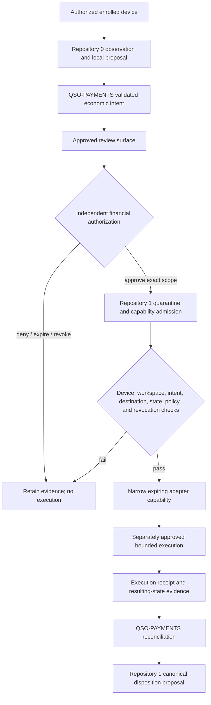

# Portable Trust and Financial Authority Boundary

## Purpose

Repositories `0` and `1` are the candidate portable first-install security foundation for a new, recovered, replaced, reset, or suspect owned device. QSO-PAYMENTS is the candidate economic-intent, allocation-preview, evidence, dispute, and reconciliation subsystem.

These roles must glue together without collapsing into one authority. A device may be known, measured, compliant with an approved host baseline, and admitted to Repository `1` while still having **no authority to approve, sign, submit, or settle a financial action**.

Likewise, a valid financial authorization does not authorize arbitrary device remediation, repository writes, credential discovery, network changes, or execution on a different host.

> **Core invariant:** portable device trust establishes where a bounded action may run; independent financial authorization establishes whether a particular economic action may occur. Neither implies the other.

## Scope

This profile is documentation-only. It defines candidate identity bindings, trust boundaries, state transitions, evidence requirements, loss and theft behavior, revocation propagation, and compatibility witnesses. It does not add schemas, credentials, custody, signing, adapters, transfers, monitoring, remote administration, settlement, or canonical-state authority.

## Separate subjects

Every future record must distinguish at least these subjects:

| Subject | Meaning | Must not be confused with |
|---|---|---|
| Device | Physical or virtual host under explicit ownership or authorization | User, workspace, financial account, adapter, or payee |
| Device enrollment | Repository `1` record admitting a device identity and baseline profile | Financial approval or reusable execution permission |
| Workspace | Repository, checkout, environment, and exact source identity used for engineering work | Device ownership or payment destination |
| Requester | Person or approved service proposing a resource need | Beneficiary, approver, credential holder, or executor |
| Beneficiary | Party expected to receive the funded benefit | Requester, payee, or destination account |
| Financial authority | Named human or separately approved service that approves exact economic scope | Repository `0`, Repository `1`, QSO-PAYMENTS, interface, or device trust service |
| Capability | Narrow technical permission admitted after valid financial authorization | Financial authorization itself |
| Adapter | Disabled or separately approved component capable of executing one bounded operation | Financial authority, canonical state, or settlement proof |
| Destination | Tokenized or protected payment endpoint bound to the authorization | Device identity, workspace, or beneficiary identity |
| Receipt | Evidence returned from an attempt | Independent reconciliation, canonical acceptance, or legal finality |

Identifiers may be cross-referenced, but they must not be reused as if they represent the same entity.

## Candidate authority flow

A device enrollment may be a prerequisite for execution, but it is never sufficient financial authorization. Repository `1` may verify and narrow an accepted authorization into a technical capability; it cannot invent, broaden, or renew the underlying financial approval.

## Required bindings

A future capability-admission request should bind all of the following:

- immutable device identity and enrollment generation;
- ownership or authorization scope and enrollment authority;
- platform and baseline-policy profile;
- workspace, repository, base commit, expected head, and execution environment;
- resource proposal, economic intent, review packet, and financial authorization identifiers;
- requester, beneficiary, destination class, adapter, and currency/unit identities;
- exact amount or cap, precision, fees, taxes, quote time, and expiry;
- nonce, replay domain, idempotency key, retry limit, and attempt limit;
- expected pre-state, permitted operation, expected post-state, and evidence obligations;
- privacy class, retention policy, redaction rules, and publication prohibition;
- issuer, executor, verifier, revoker, incident owner, emergency-stop owner, and recovery owner.

Any missing, ambiguous, unsupported, stale, revoked, or mismatched binding fails closed.

## Trust states

Portable trust and financial state progress independently.

### Device trust states

- `UNENROLLED`
- `QUARANTINED`
- `OBSERVED`
- `BASELINE_UNKNOWN`
- `BASELINE_MISMATCH`
- `ENROLLED`
- `RESTRICTED`
- `LOST`
- `STOLEN`
- `REVOKED`
- `RETIRED`
- `RECOVERY_PENDING`

### Financial states

- `PROPOSED`
- `VALIDATED`
- `DENIED`
- `HELD`
- `AUTHORIZED`
- `EXPIRED`
- `REVOKED`
- `CAPABILITY_ADMITTED`
- `SUBMITTED`
- `PENDING`
- `FAILED`
- `UNKNOWN`
- `DISPUTED`
- `REVERSED`
- `RECONCILED`
- `SUPERSEDED`

No mapping may treat `ENROLLED` as `AUTHORIZED`, `CAPABILITY_ADMITTED` as `SUBMITTED`, `SUBMITTED` as `RECONCILED`, or `RECONCILED` as unconditional legal finality.

## Lost, stolen, or replaced device behavior

When a device is reported lost, stolen, retired, or materially uncertain:

1. mark the device enrollment generation as restricted or revoked;
2. deny new capabilities bound to the device;
3. revoke active device-bound payment capabilities where supported;
4. preserve the last known device, intent, authorization, capability, and receipt evidence;
5. invalidate cached approvals and review sessions that depended on the device;
6. rotate or revoke device-bound adapter credentials through their independent owner;
7. do not claim remote erasure, credential revocation, or session termination succeeded without verifiable evidence;
8. enroll a replacement device through the portable-trust bootstrap process;
9. reissue only the minimum required capabilities after new device and workspace checks pass;
10. keep the prior device identity revoked rather than silently transferring its authority.

A prior financial authorization may require explicit reauthorization when the execution device changes, even when amount and destination remain unchanged.

## Wrong-device and wrong-workspace rejection

A valid authorization must fail if presented from:

- an unrecognized, revoked, lost, stolen, retired, or unsupported device;
- the correct device with a different enrollment generation;
- the correct device and wrong workspace or repository;
- the correct workspace at the wrong base commit or expected head;
- a different adapter, environment, destination class, currency, or policy profile;
- a device whose baseline state is unknown when the capability requires an accepted baseline;
- a review session or cached decision created before a relevant correction or revocation.

The failure record must preserve the mismatch reason without exposing reusable credentials or unnecessary financial metadata.

## Separation of emergency controls

At least three independent stop domains are required:

1. **Device stop** — quarantine or revoke a host and its device-bound capabilities.
2. **Financial stop** — deny or revoke the economic authorization regardless of device state.
3. **Adapter stop** — disable the execution component and credentials regardless of Repository `0`, Repository `1`, or QSO-PAYMENTS availability.

A portfolio-wide freeze may invoke all three, preserve evidence, invalidate caches, prevent retries, and require explicit recovery approval. No stop has an automatic self-service unlock.

## Privacy and minimization

Portable host evidence and financial evidence have different sensitivity and retention requirements. Cross-repository records should carry references and hashes rather than copying raw inventories, account identifiers, full destination details, credentials, or unrelated host data.

Minimum rules:

- public Pages artifacts contain no device identifiers, network inventories, account data, authorization records, receipts, or secrets;
- review surfaces show only fields needed for the current decision and clearly mark redaction or transformation;
- device inventories do not become payment metadata by default;
- financial metadata does not become a general-purpose host telemetry source;
- corrections, disputes, and revocations propagate without deleting required incident evidence;
- retention and deletion rules identify the authority able to approve exceptions.

## Gluing witnesses

### Pairwise fixtures

- Repository `0` observation → QSO-PAYMENTS intent preserves device and workspace references without promoting host trust into financial approval.
- Financial authorization → Repository `1` capability admission rejects missing or mismatched device bindings.
- Repository `1` capability → adapter instruction is equal or narrower across device, workspace, amount, destination, environment, duration, and operation.
- Adapter receipt → QSO-PAYMENTS reconciliation preserves attempt identity, device identity, raw-evidence hash, uncertainty, and correction route.
- Device revocation → capability cache invalidation prevents new attempts and retries.

### Triple-overlap fixtures

1. **Repository `0` → QSO-PAYMENTS → financial authority**
   - a trusted device cannot approve its own resource request;
   - requester, beneficiary, and approver identities remain distinct;
   - wrong-device review sessions fail closed.

2. **Financial authority → Repository `1` → adapter**
   - authorization and capability scopes are independently verified;
   - device and workspace bindings match exactly;
   - capability broadening, replay, expiry, and revocation fail closed.

3. **Adapter → QSO-PAYMENTS → Repository `1`**
   - execution success does not force reconciliation or canonical acceptance;
   - wrong-device, partial, pending, failed, disputed, reversed, and unknown outcomes remain explicit;
   - correction and supersession preserve prior evidence.

4. **Lost device → Repository `1` → financial authority**
   - active device-bound capabilities are revoked or marked unresolved;
   - cached approvals are invalidated;
   - replacement-device execution requires a fresh admissible binding and, where policy requires, reauthorization.

5. **Incident authority → evidence store → review surfaces**
   - freeze state propagates without deleting evidence;
   - sensitive host and financial records remain access-controlled;
   - recovery cannot resume from stale cached state.

## Material obstruction

The portfolio now describes both a portable device-trust plane and an economic-intent plane, but it has not adopted one jointly versioned contract proving that:

- device enrollment is independent from financial approval;
- a financial authorization is bound to the correct device and workspace when execution requires those subjects;
- Repository `1` can narrow technical scope without becoming financial authority;
- device loss, theft, replacement, revocation, correction, and recovery propagate through payment capabilities and review caches;
- host observations and financial metadata remain separately minimized and governed.

Without this contract, a technically trusted device could be misrepresented as financially trusted, or a valid financial authorization could execute on the wrong, revoked, or compromised host.

## Acceptance decisions still required

The Architect and named authorities must approve:

1. device identity, enrollment, ownership-scope, replacement, and revocation methods;
2. workspace and exact-source identity methods;
3. independent financial authorizer and revoker;
4. Repository `1` capability-admission and canonical-disposition limits;
5. device-bound versus device-independent authorization policy;
6. adapter credential and signing custody;
7. privacy, retention, correction, incident, emergency-stop, recovery, and rollback ownership;
8. canonical schema/package owner, serialization, hashing, signing, and compatibility policy;
9. shared deterministic fixtures across Repositories `0` and `1`, QSO-PAYMENTS, the review surface, and the disabled adapter.

Until these decisions and witnesses are accepted, the portable trust and financial routes remain documentation-only and non-operational.
