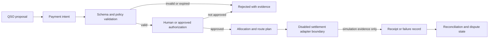

# QSO-PAYMENTS Project Guide

QSO-PAYMENTS defines an audit-first documentation and contract boundary for payment intent in the Quantum State Object ecosystem. Its first release is deliberately documentation-only: it explains how economic proposals are represented, reviewed, authorized, disputed, and handed to disabled external adapters without implying custody or production settlement capability.

> **Current maturity:** charter candidate. No executable transfer, signing, custody, credential, testnet, or production settlement path is approved.

## Product purpose

QSO-PAYMENTS exists to make economic intent reviewable before any external system is allowed to act. It separates:

- what a QSO proposes;
- what policy permits;
- what a human or authorized service approves;
- how allocations are calculated;
- what evidence a disabled adapter would require;
- how receipts, disputes, reversals, and reconciliation are represented.

The repository does not provide banking, investment, custody, brokerage, escrow, money-transmission, or guaranteed-return services.

## Authority model

A proposal never becomes authorization merely because it is well-formed. Authorization never becomes settlement merely because an allocation is complete. Documentation and fixtures never establish production capability.

## Environment labels

| Environment | Permitted meaning | Prohibited implication |
|---|---|---|
| Documentation | Describes concepts, contracts, risks, and review procedures | A working service exists |
| Simulation | Deterministic local calculations with fictional values and no credentials | Assets can move |
| Testnet | Separately approved integration using non-production networks and isolated credentials | Production readiness |
| Production | Independently authorized, audited, monitored, and legally reviewed deployment | Inferred from any earlier stage |

The current repository release surface is **Documentation** only.

## Contract families

### Payment intent

A bounded proposal should identify purpose, asset or unit, amount, recipients, expiry, provenance, environment, idempotency key, and the policy profile under which it may be reviewed.

### Authorization

Authorization is an independent record containing approver identity or role, approved scope, limits, timestamps, conditions, and revocation state. It must never be inferred from QSO identity, prior behavior, or a generated recommendation.

### Allocation

Allocation transforms an authorized total into explicit destinations using declared rounding, remainder, cap, and priority rules. Every route must reconcile to the approved total or fail closed.

### Receipt and reconciliation

A receipt records what an external adapter reports, including adapter identity, environment, reference, result, timestamps, hashes, and failure details. Reconciliation compares intent, authorization, allocation, and receipt without rewriting their original records.

### Dispute and rollback

A dispute links contested records, reason codes, evidence, review status, and permitted remediation. Rollback means withdrawing a documentation or simulation candidate, disabling an adapter, revoking credentials, or restoring a prior verified publication artifact; it does not imply reversal is always possible in an external financial network.

## Threat model

QSO-PAYMENTS documentation and future contracts must account for:

- forged or replayed authorization;
- ambiguous environment labels;
- allocation totals that do not reconcile;
- rounding or remainder manipulation;
- stale, duplicate, or expired intents;
- adapter substitution and receipt forgery;
- credential leakage or excessive workflow permissions;
- claims that imply custody, legal approval, guaranteed returns, or production capability;
- privacy leakage through payment metadata;
- inaccessible notices or review controls.

## Developer onboarding

1. Read `README.md`, `taskchain.md`, `release.md`, and `changelog.md`.
2. Treat P0 charter approval as a hard gate; documentation may be refined, but approval must not be invented.
3. Keep all current examples fictional, deterministic, and credential-free.
4. Label every capability statement as documentation, simulation, testnet, or production.
5. Separate intent, authorization, allocation, adapter, receipt, dispute, and reconciliation records.
6. Add positive and negative fixtures before proposing executable schemas.
7. Record exact publication commands, workflow versions, link/accessibility/security results, artifact hashes, and rollback evidence.

## Documentation release gates

The first documentation candidate is not ready until:

- the payment-boundary charter is approved;
- terminology, users, jurisdictions, privacy assumptions, license, and prohibited capabilities are explicit;
- the Pages artifact is reproducible from one immutable commit;
- links, HTML, accessibility, claims, privacy, security, and workflow permissions are reviewed;
- checksums, provenance, and rollback instructions are retained;
- no page implies production custody, signing, settlement, investment returns, or autonomous transfers.

## Documentation map

- [Public project page](index.html)
- [Architecture and trust boundaries](ARCHITECTURE.md)
- [Task chain](../taskchain.md)
- [Release plan](../release.md)
- [Changelog](../changelog.md)
- [Repository overview](../README.md)
