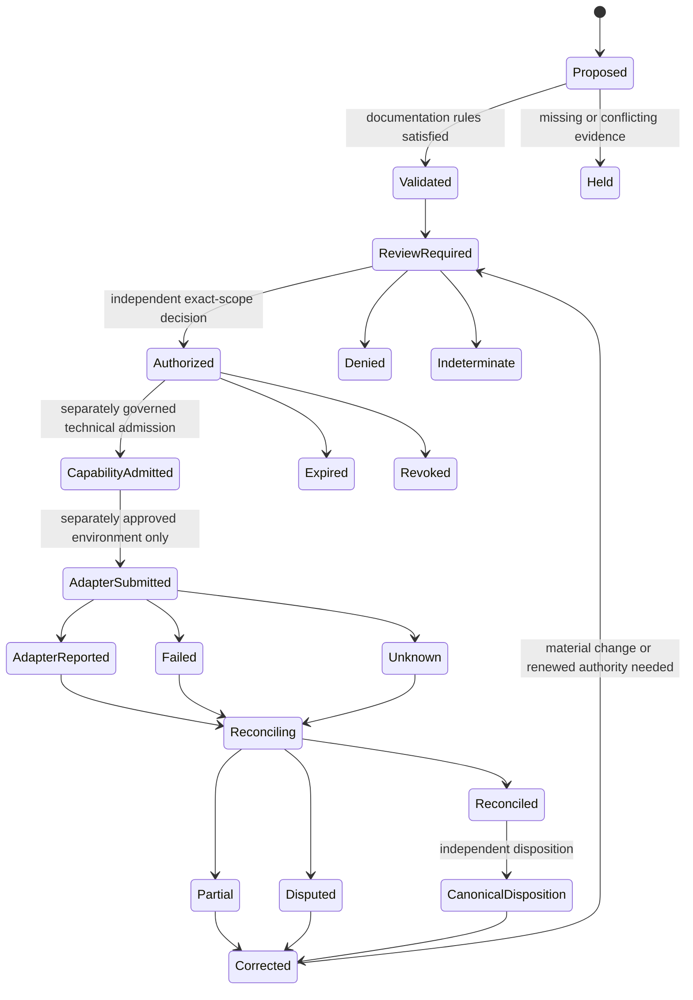

# Status, finality, and correction lifecycle

## Status

`DOCUMENTED_NOT_IMPLEMENTED`

This guide defines a review vocabulary for economic-intent, authorization, adapter-evidence, reconciliation, correction, and dispute states. It is documentation only. It does not create an executable state machine, approve a schema, appoint an authority, activate an adapter, establish settlement, or grant financial, release, publication, credential, custody, or signing authority.

## Why this guide exists

Payment systems often fail through semantic collapse rather than arithmetic error: a proposal is described as approved, a submitted instruction is described as paid, an adapter receipt is described as final, or a corrected record silently replaces the history it corrects. QSO-PAYMENTS must preserve the difference between what was requested, what was reviewed, what was technically attempted, what an external system reported, what remains uncertain, and what an independent authority accepted.

The safe rule is:

> **No later status erases the provenance, limitations, uncertainty, or authority boundary of an earlier record.**

## Record families

| Record family | What it may establish | What it must not establish |
|---|---|---|
| Resource proposal | A bounded request and supporting evidence exist | Financial approval or available funds |
| Economic intent | The request was normalized and validated against documentation rules | Approval, capability, custody, or execution |
| Financial review | Evidence and conflicts were reviewed | Authority unless an approved independent authorizer issues an attributable decision |
| Financial authorization | A designated authority approved an exact scope under an approved policy | Credentials, custody, adapter access, settlement, publication, or reusable general permission |
| Capability admission | Repository `1` or an approved successor admitted a narrow technical action | Financial approval or broader scope than the authorization |
| Adapter submission | A bounded instruction was presented to a disabled-by-default adapter boundary | Acceptance, execution, settlement, or finality |
| Adapter evidence | An external system or simulator reported an outcome | Truth, canonical acceptance, legal finality, or successful reconciliation |
| Reconciliation | Evidence, expected effects, duplicates, fees, reversals, and discrepancies were compared | Automatic legal or canonical finality |
| Disposition | An approved authority recorded a bounded portfolio decision | Erasure of disputes, corrections, revocations, or prior evidence |

## Three independent status dimensions

A single `status` field is insufficient. Every future record profile must preserve three independent dimensions.

### 1. Processing status

Describes where the record is in the technical workflow.

- `RECEIVED`
- `VALIDATED`
- `HELD`
- `SUBMITTED`
- `OBSERVED`
- `RECONCILING`
- `COMPLETED`
- `FAILED`
- `CANCELLED`
- `UNKNOWN`

`COMPLETED` means only that the bounded processing stage completed. It must not imply authorization, settlement, finality, or canonical acceptance.

### 2. Authority status

Describes whether an approved independent authority issued a decision for the exact scope.

- `DOCUMENTED_NOT_AUTHORIZED`
- `REVIEW_REQUIRED`
- `INDETERMINATE`
- `BLOCKED`
- `DENIED`
- `AUTHORIZED`
- `EXPIRED`
- `REVOKED`
- `SUPERSEDED`
- `WITHDRAWN`
- `DISPUTED`
- `UNKNOWN`

Only `AUTHORIZED` may represent financial approval, and only when the authorizer, authority source, intent digest, amount, asset, destination, environment, adapter, time window, device/workspace/repository bindings, conflicts, and prohibited effects are all explicit. Even then, authorization is not a credential or settlement result.

### 3. Evidence and finality status

Describes the strength and current interpretation of execution evidence.

- `NO_EXECUTION_EVIDENCE`
- `SIMULATED`
- `PENDING_EXTERNAL_CONFIRMATION`
- `ADAPTER_REPORTED`
- `PARTIAL`
- `REVERSED`
- `REFUNDED`
- `DISPUTED`
- `RECONCILED`
- `CANONICALLY_ACCEPTED`
- `LEGAL_FINALITY_UNDETERMINED`
- `UNKNOWN`

`ADAPTER_REPORTED` is the highest status an adapter may assign to itself. `RECONCILED` requires independent comparison against the exact authorized scope, expected allocation, idempotency domain, fees, taxes, reversals, and duplicate effects. `CANONICALLY_ACCEPTED` requires an independently governed disposition. Legal finality remains a separate jurisdiction-sensitive determination and must never be inferred from technical success.

## Lifecycle diagram

**Equivalent prose:** A proposal may be validated or held. Validation leads to independent review, which may authorize, deny, block, or remain indeterminate. An exact financial authorization may later support a separately governed narrow capability. Only a separately approved environment may submit through an adapter. The adapter may report evidence, fail, or leave the outcome unknown. Every outcome proceeds to reconciliation, which may produce reconciled, partial, disputed, reversed, or unknown evidence. An independent disposition may accept a reconciled result, but a later correction, revocation, dispute, reversal, or newly discovered fact remains linked and may require renewed review. No transition deletes the earlier record or broadens authority.

## Transition requirements

Every proposed transition must bind:

- source record identifier, profile, version, and digest;
- exact predecessor status dimensions;
- actor identity and narrow role;
- authority source or explicit statement that authority effect is `NONE`;
- event time and observation time;
- device, enrollment generation, workspace, repository, expected head, environment, adapter, and destination where applicable;
- reason code and human-readable explanation;
- supporting and contradictory evidence;
- missing evidence and uncertainty;
- correction, revocation, dispute, and supersession links;
- downstream consumers and acknowledgment state;
- privacy, retention, disclosure, and redaction class;
- rollback and recovery effect.

An unknown status, profile, reason code, predecessor, actor role, or authority source must fail closed. A consumer must not invent a transition to preserve workflow progress.

## Prohibited transitions and interpretations

The following are invalid even if a workflow or interface permits them:

- proposal directly to `AUTHORIZED`;
- device enrollment directly to financial approval;
- complete review form directly to financial approval without a designated authority;
- financial authorization directly to adapter execution without separate capability and environment gates;
- adapter submission directly to `RECONCILED` or `CANONICALLY_ACCEPTED`;
- adapter-reported success directly to legal finality;
- retry after an unknown outcome without the original idempotency and replay domains;
- correction by editing or deleting the original record;
- revocation that fails to invalidate dependent cached review or capability state;
- partial success represented as full success;
- a later record broadening amount, destination, asset, environment, time, device, workspace, repository, or adapter scope;
- any state inferred solely from color, iconography, UI location, document formatting, cryptographic form, workflow success, or model confidence.

## Partial failure and unknown outcome

A partial or unknown outcome is not an inconvenience to normalize away. It is a first-class blocking condition.

A reconciliation record for `PARTIAL` or `UNKNOWN` must state:

1. which routes or amounts have reliable evidence;
2. which effects are absent, contradictory, stale, or unreachable;
3. whether a retry could duplicate an effect;
4. whether an authorization or capability has expired or been revoked;
5. whether fees, taxes, rounding, or reversals changed the expected total;
6. which consumers received correction or emergency-stop notices;
7. what remains frozen;
8. what evidence would permit bounded recovery;
9. who may approve the next step;
10. why the status cannot yet be represented as reconciled or final.

## Correction, revocation, and dispute

Corrections are append-only records that identify the incorrect claim, explain the evidence change, preserve the earlier generation, and propagate to every consumer. Revocation terminates future reliance on an authorization or capability but does not erase historical evidence. A dispute records a contested interpretation or effect and must remain visible until an approved disposition resolves or supersedes it.

A correction or revocation is incomplete when any registered consumer is unreachable, has not acknowledged the update, continues to expose a stale claim, or cannot invalidate cached authority. Incomplete propagation remains a blocking finding.

## Accessibility and public explanation

Every rendered status must include visible text containing:

- the processing status;
- the authority status;
- the evidence/finality status;
- the exact object and scope;
- the actor or owner, or an explicit vacancy;
- the last observation time;
- known uncertainty and missing evidence;
- whether correction, revocation, dispute, or rollback is active;
- the next permitted reviewer action.

Color, icons, animation, diagrams, tooltips, hidden panels, or portfolio-specific shorthand may supplement but never replace this text. Tables must linearize sensibly for screen readers and remain usable under zoom and reflow.

## Reviewer onboarding

A reviewer should be able to answer, in order:

1. Which record family is being reviewed?
2. What are the three independent status dimensions?
3. Which exact prior record and digest does it depend on?
4. Who acted, under what approved role and authority source?
5. What changed, and what did not change?
6. Could any consumer mistake technical completion for financial approval or finality?
7. Are partial, unknown, reversed, disputed, corrected, expired, or revoked states visible?
8. Did every dependent consumer receive and acknowledge corrections or revocations?
9. Can the prior bounded state be restored without deleting incident history?
10. Is a human architectural, financial, legal, privacy, accessibility, security, incident, recovery, release, or publication decision still required?

Stop review and preserve the current state when any answer is unknown, contradictory, unsupported, or outside the reviewer’s authority.

## FYSA-120 capability map

This guide applies:

- `011-B` and `011-E` for accessible lifecycle diagrams and diagram–prose consistency;
- `012-A`, `012-B`, `012-D`, and `012-E` for information architecture, API-style status exposition, terminology controls, documentation testing, and lifecycle synchronization;
- `017-C`, `017-D`, and `017-E` for lineage, version-substitution detection, audit packaging, and correction propagation;
- `018-B`, `018-D`, and `018-E` for record classification, reviewer onboarding, responsibility mapping, and contested-history preservation;
- `019-B`, `019-C`, and `019-D` for plain language, screen-reader-compatible status explanation, and uncertainty communication;
- `031-A`, `031-D`, and `031-E` for state-machine requirements, hostile transition review, and regression prevention;
- `032-A`, `032-D`, and `032-E` for distributed-state semantics, idempotency, partial failure, recovery, and causal incident diagnosis;
- `040-D` and `040-E` for compatibility migration, rollback, record integrity, and restored-state verification.

Proposed non-authoritative subdivision:

**`032-L — Multi-dimensional payment status, finality separation, and correction-closed distributed lifecycle documentation`**

Taxonomy mapping identifies required capabilities only. It does not establish competence, ownership, approval, implementation, or operational authority.

## Approval boundary

Before implementation, the portfolio must approve the canonical status and reason-code owner, record profiles, identity namespaces, transition authority, independent financial authorizer, Repository `1` disposition role, adapter evidence contract, consumer registry, correction/revocation topology, privacy and retention rules, migration, rollback, restored-state witnesses, accessibility review, and publication authority.
