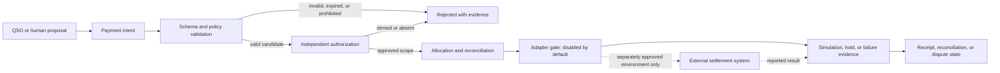

# QSO-PAYMENTS

**Auditable payment intent without uncontrolled custody.**

QSO-PAYMENTS documents the boundary between an economic proposal and any external system that could move assets. The current release surface is documentation only: it defines responsibilities, records, evidence, and review gates without providing custody, signing, credentials, testnet execution, production settlement, investment products, or guaranteed returns.

!!! warning "Current maturity"
    This repository is a charter candidate. Documentation may explain a future interface, but it does not establish that the interface exists, is authorized, or is suitable for production use.

## Authority model

A valid proposal is not authorization. Authorization is not settlement. A receipt is adapter-supplied evidence and does not erase uncertainty about an external network.

## Current product boundary

| Area | Current status | Meaning |
|---|---|---|
| Documentation | In scope | Architecture, terminology, trust boundaries, review procedures, release evidence |
| Simulation | Not yet approved | Future deterministic calculations using fictional values and no external credentials |
| Testnet | Not authorized | Requires separate contract, security, privacy, and operations approval |
| Production | Prohibited by current scope | Cannot be inferred from schemas, fixtures, documentation, or testnet activity |

## Core guarantees

1. A QSO cannot approve its own payment intent.
2. Authorization is explicit, attributable, scoped, revocable, and environment-specific.
3. Allocation routes must reconcile exactly under declared rounding and remainder rules.
4. Credentials, private keys, and sensitive account identifiers never belong in public records or repository fixtures.
5. Adapters remain disabled unless a separately approved release activates a named version and environment.
6. Original intent, authorization, allocation, receipt, and dispute records remain linked and append-only.
7. Unknown or unresolved status is preserved rather than presented as successful settlement.

## Documentation map

- [Project guide](PROJECT_GUIDE.md): purpose, terminology, contract families, threats, and release gates.
- [Architecture](ARCHITECTURE.md): trust boundaries, lifecycle, data classes, dependencies, and verification strategy.
- [Design contracts](DESIGN_CONTRACTS.md): proposed record semantics, invariants, failure modes, and compatibility rules.
- [Developer onboarding](ONBOARDING.md): local documentation setup, contribution workflow, and review checklist.
- [Security and privacy](SECURITY_PRIVACY.md): threat model, data minimization, secret handling, and claims controls.
- [Operations and recovery](OPERATIONS.md): publication, evidence retention, incident response, and rollback.
- [ADR-0001](decisions/0001-documentation-only-boundary.md): why the first release is documentation-only.

## Release posture

The release remains blocked until the payment-boundary charter is approved and one immutable candidate commit has reproducible Pages output, link and HTML validation, accessibility review, claims review, security and privacy review, workflow-permission review, checksums, provenance, and rollback evidence. See the repository [task chain](https://github.com/aevespers2/QSO-PAYMENTS/blob/main/taskchain.md), [release plan](https://github.com/aevespers2/QSO-PAYMENTS/blob/main/release.md), and [changelog](https://github.com/aevespers2/QSO-PAYMENTS/blob/main/changelog.md).
